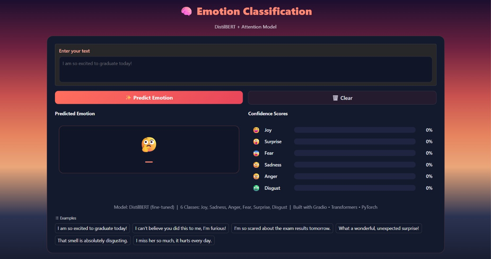
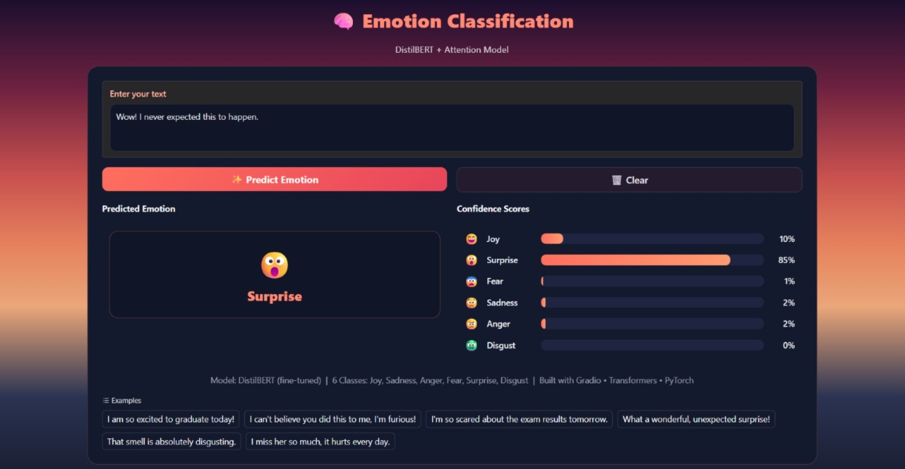

# 🧠 Emotion Classification with Attention

<div align="center">

# 🧠 Emotion Classification

### DistilBERT + Attention-Based Emotion Recognition

Detect human emotions from text using Deep Learning and Transformer models.


</div>

---

# 📌 Overview

This project performs **multi-class emotion classification** using both sequence models and Transformer-based architectures.

The system predicts one of the following six emotions:

- 😊 Joy
- 😢 Sadness
- 😠 Anger
- 😨 Fear
- 😲 Surprise
- 🤢 Disgust

The project compares multiple deep learning architectures and deploys the best-performing model through an interactive **Gradio** web application.

---

# 🚀 Models Compared

| Model | Accuracy | Macro F1 |
|--------|---------:|---------:|
| 🏆 DistilBERT (Fine-tuned) | **80.96%** | **69.10%** |
| BiLSTM + Attention | 68.97% | 59.23% |
| LSTM | 67.02% | 58.53% |
| GRU | 65.19% | 56.13% |

---

# 📂 Dataset

**GoEmotions Dataset**

Developed by Google Research.

It contains thousands of Reddit comments annotated with emotions.

For this project, the original labels were mapped into **6 core emotions**:

- Joy
- Sadness
- Anger
- Fear
- Surprise
- Disgust

---

# 🧩 Features

- Text Cleaning
- Tokenization
- Sequence Padding
- GloVe Word Embeddings
- LSTM
- GRU
- BiLSTM + Attention
- Fine-tuned DistilBERT
- Accuracy Evaluation
- Macro F1 Score
- Classification Report
- Confusion Matrix
- Interactive Gradio Interface

---

# 🖥️ Application Preview

## Home Screen

> Save this image as **screenshots/home.png**

```text
screenshots/home.png
```



---

## Prediction Example

> Save this image as **screenshots/prediction.png**

```text
screenshots/prediction.png
```



---

# 🏗️ Project Structure

```text
Emotion-Classification-with-Attention/
│
├── app.py
├── requirements.txt
├── README.md
│
├── config.json
├── model.safetensors
├── tokenizer.json
├── tokenizer_config.json
├── special_tokens_map.json
│
├── notebook.ipynb
│
└── screenshots/
      ├── home.png
      └── prediction.png
```

---

# ⚙️ Installation

Clone the repository

```bash
git clone https://github.com/YOUR_USERNAME/Emotion-Classification-with-Attention.git
```

Move into the project directory

```bash
cd Emotion-Classification-with-Attention
```

Install dependencies

```bash
pip install -r requirements.txt
```

Run the application

```bash
python app.py
```

---

# 🛠 Technologies

- Python
- TensorFlow
- PyTorch
- HuggingFace Transformers
- DistilBERT
- Gradio
- NumPy
- Pandas
- Scikit-learn
- Matplotlib

---

# 📊 Evaluation Metrics

- Accuracy
- Macro F1 Score
- Precision
- Recall
- Confusion Matrix

---

# 💡 Future Improvements

- RoBERTa Fine-tuning
- BERTweet Support
- Attention Visualization
- Explainable AI (SHAP/LIME)
- Online Deployment

---

# 👩‍💻 Author

**Basmala Khaled**

AI Engineer

GitHub:
https://github.com/basmalakhaled20

---

<div align="center">

⭐ If you found this project useful, don't forget to star the repository.

</div>